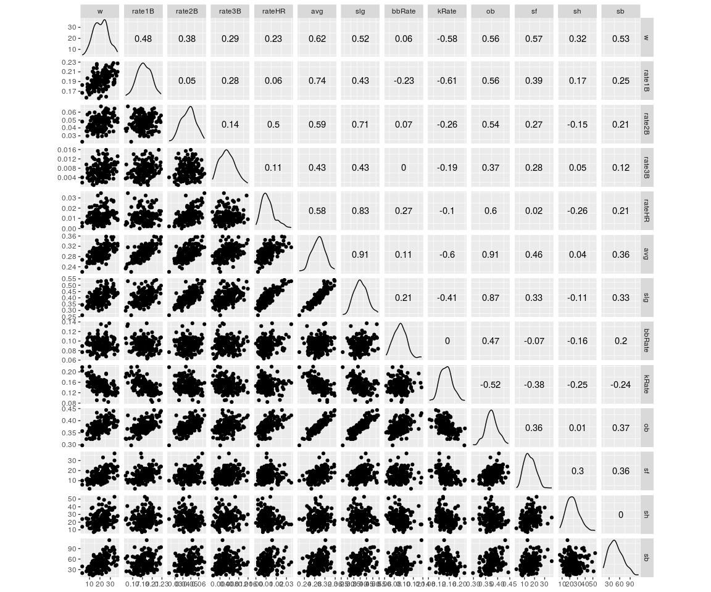
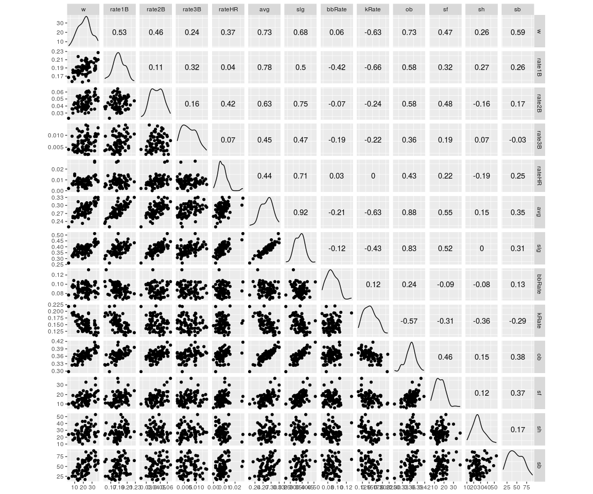
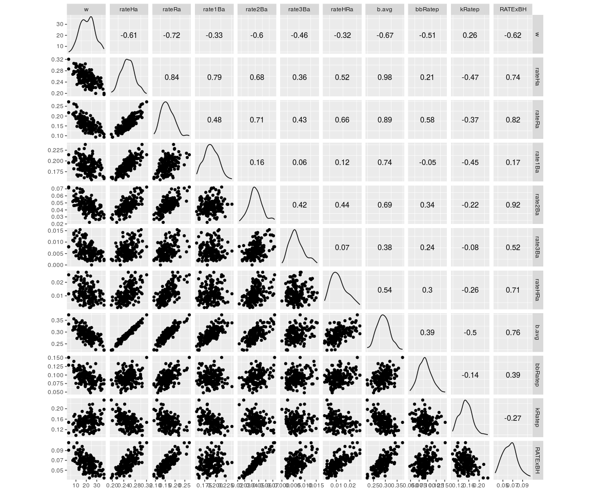

Utilizing almost 2 decades worth of American Rivers Conference baseball data, we can objectively determine optimal game strategies. Due to the differentiating run enviornments between the ARC and MLB, game strategies should reflect what this data shows. A big reason why Coe Baseball was so successful in 2019 was because we played to the optimal strategies of the ARC. Through the following correlation plots, the important aspects of run scoring and run prevention are shown. As a result, we can not only ensure that our in-game strategies are data driven, but we can also optimize practice time as we correctly train the outcomes that result in wins.  

Wins are what we care about, so pay attention to the top row of the corrplot below. 

<!-- -->

This is telling us that hitting for contact consistently is more important than hitting for power, as it tends to more often translate to wins in the ARC. It's not that extra base hits aren't going to help you win games; it's that teams should not sell out for power while accepting the strikeouts that come with this kind of approach. Limiting strikeouts is also more important than drawing walks, by a huge amount.

Teams need to focus on making their opponents make plays because given enough chances, most teams will start to make mistakes. It's very interesting that having a good walk rate as a team really has no correlation to winning. Sorry Billy Beane. My theory is that teams that tend to value working the count to draw walks are taking good pitches to hit that could result in an extra base hit, or drive in a runner that's in scoring position. A hitter could end up just taking a couple good pitches to hit and set up a double play with a walk. Do teams that draw walks feel the need to bunt him to second to avoid the double play? The corrplot does not show this. In fact, it shows a negative correlation (-0.162) between walks and sacrifice hits.

These findings exemplify the idea that our run environment in the ARC is drastically different than MLB's. The three true outcome hitter in the ARC is not the kind of player teams want to develop. Another way to support this assertion is by calculating the run values of each in-game hitting outcome.

To get the most precise outcomes for run values, we calculated the average number of runs scored in an inning after this event happened and then subtracted the starting run expectancy. Home runs have been worth 1.59 runs, while strikeouts are worth -.40 runs. With data going back to the 2002 season, it tells us that there have been 2,734 total home runs hit in the ARC since then, or 1.2% of total plate appearances. For comparison, major leaguers hit home runs on 2.9% on their plate appearances over this same period. Plate appearances have ended in a strikeout 14.7% of the time in the ARC and 20% in MLB. Teams in the ARC are commonly making the mistake of basing their hitting points of emphasis on MLB trends when, in fact; homers are hit at more than twice the rate in MLB, along with a considerable difference in strikeout rates.

The run values also exemplify that the trade-off of a power driven approach and is simply not worth it. This strategy is inevitably paired with strikeouts as the outcome of failure. A strikeout, on average, decreases run probability by 40% in a given inning. Even though home runs provide the greatest run value, when you factor in the frequency in which they happen, it unequivocally points to the optimal strategy of contact hitting and strikeout prevention. 

To ensure that the run-crazy BESR era isn't skewing the results too much, I ran the corrplot for just the years 2011-2019 -- when the NCAA switched to BBCOR bats.

<!-- -->

The biggest takeaway is that there is a decently strong negative correlation between walk rate and single rate. Teams that prioritize walks typically can't get them into scoring position with a hit. A .472 correlation coefficient between wins and sac-flies shows that getting runners to third with less than 2 outs and then being able to execute a deep (enough) fly-ball is important. Also, a stronger .773 correlation between on-base percentage and wins, without a strong correlation between walks and wins, further emphasizes the ball-in-play importance. 

In terms of how this should effect strategy, teams should look to attack mistake pitches that pitchers want to get ahead in the count with. This is supported by the table below. 0-0 counts produced the highest batting average and best OPS of any non-3-ball counts in the ARC from 2017-2019.[^1] We need to attack any and all get-me-over 0-0 pitches. The idea of "working the count" is not supported by the data, unless a given pitcher is clearly struggling to throw consistent strikes. 

[^1]: The data used for batting average, on-base percentage, and slugging percentage by count was from 2017-2019 play-by-play events that had recorded pitch sequence data for each at-bat. This includes 10,650 at-bats. 

| Count | Results (H/AB) | Triple Slash (OPS) |
|:-----:|:-----:|:-----:|
| 0-0 | 556/1460 | .380/.391/.544 (.935) |
| 0-1 | 268/844 | .317/.338/.432 (.770) |
| 0-2 | 149/865 | .172/.184/.222 (.406) |
| 1-0 | 273/833 | .328/.345/.474 (.819) |
| 1-1 | 265/757 | .350/.362/.501 (.863) |
| 1-2 | 240/1392 | .172/.191/.208 (.399) |
| 2-0 | 99/268 | .369/.380/.481 (.861) |
| 2-1 | 163/481 | .339/.339/.470 (.809) |
| 2-2 | 229/1168 | .196/.219/.243 (.462) |
| 3-0 | 1/7 | .143/.975/.143 (1.118) |
| 3-1 | 82/235 | .349/.726/.536 (1.262) |
| 3-2 | 185/725 | .255/.525/.343 (.868) |
The other crucial pitch, as the data shows, is the 1-1 pitch. There is a 167-point difference in batting averege from advancing to either a 1-2 count or a 2-1 count.  

The two strike approaches, while beneficial to prevent strikeouts, generally won't produce the harder hit balls that result in hits. We want to aviod these scenarios when at all possible. Other than the sudden death nature of a full count, 2-strike counts produce sub-.200 batting averages. This why the 1-1 pitch, and to a lesser extent -- the 2-1 pitch, are so crucial in an at-bat. 

If we do find ourselves in the sub-optimal 2-strike scenario, then we want to employ an approach that even further sacrifices power potential for a better assurance of contact, especially with runners on base. Strikeouts do not allow for the random acts of D-III baseball to happen to our benefit. These include errors, bad hops on inconsistent playing surfaces, etc. The goal needs to be to work back into the count as much as possible in which see batting average and OPS rise with every additonal ball. At the very least, a productive out needs to be made.

The idea isn't to not accept walks when pitchers give them to us -- we absolutely still love free bases. We just don't want to ever go to the plate with the goal of a walk because we then miss out on other opportunities. Over aggressiveness or free-swinging is not the idea that this analysis is attempting to convey. Rather, we as a team need to employ a "selectively aggressive" approach at the plate. We can utilize the insight that we have on each opposing pitcher and either attack early as they look to get ahead, or have the patience to sit back and let them dig their own hole falling behind in counts, as our approach then becomes more particular.  

Finally, the launch angle hitting emphasis needs to stay out of the ARC. The optimal launch angle for D-III is much lower to where we want more line drives and hard ground balls. The "elevate to celebrate" culture does not translate to wins in the ARC. It results in high, deep fly balls that outfielders easily catch because they are usually not hit hard enough at this level. 2019 showed us that a lot of lower launch angle, solid base hits will produce long innings that wear down already thin pitching staffs. Even if a team can slug their way to the postseason, they will then face better quality pitching that will expose teams that can't make consistent contact.

<!-- -->

The pitching correlations tell us that limiting walks is more important than striking hitters out. This is where our area of focus should be for improvement moving into 2020. What we also learn from the corrplot above is that giving up extra base hits is not good (duh), but we know that those come from hard contact. Thus, our optimal combination is inducing a lot of soft contact, with a reliable defense behind our staff, and pairing it with low walk rates. 
 
Striking hitters out should not necessarily be a point of emphasis. This should potentially effect what pitches we throw with two strikes - should we continue to pound the zone when ahead 1-2 and 2-2 and even to a certain extent, 0-2. Strikeouts will come naturally with the stuff that our staff will feature. Until teams show the ability to consistently square up our pitchers, we should be aggressive in the zone as much as possible.

